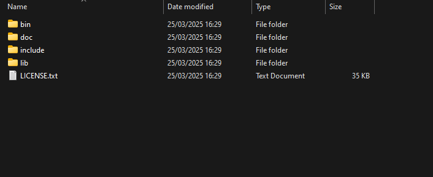
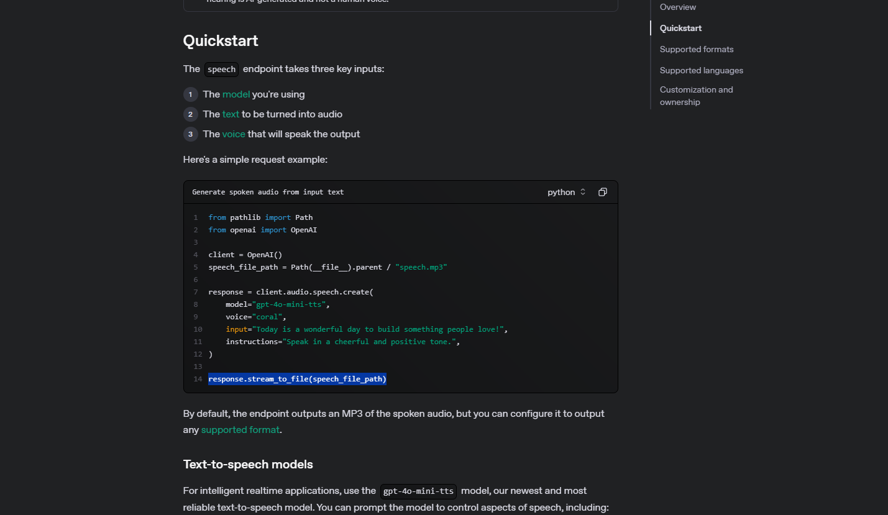
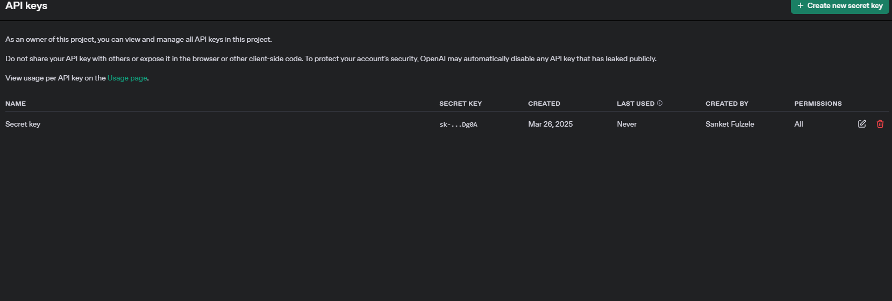
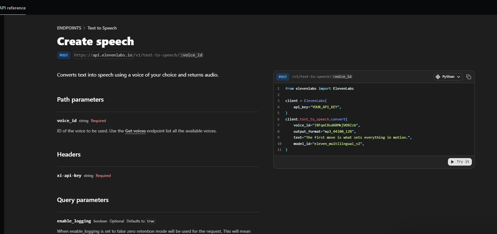
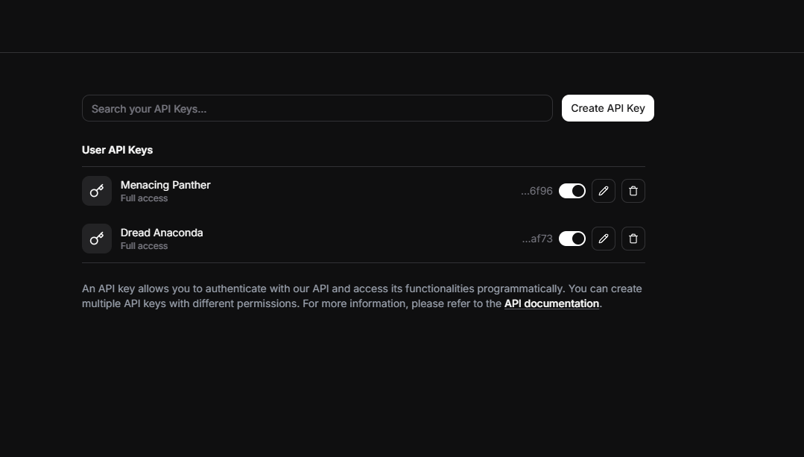
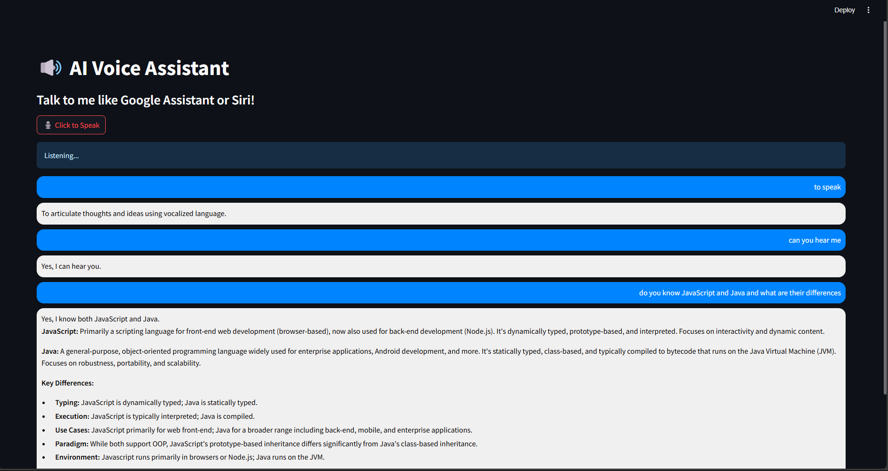

# AI Voice bot

##  Installation

###  Clone the Repository
```sh
https://github.com/SanketFZ/AI_Voice_bot.git
cd AI_Voice_bot
```

## Setting Up Virtual Environment in Python

### Create a Virtual Environment
Run the following command in your project directory:

```bash
python -m venv venv
```

On Windows (Command Prompt)
```bash
venv\Scripts\activate
```

On Windows (PowerShell)
```bash
venv\Scripts\Activate.ps1
```

On macOS/Linux
```bash
source venv/bin/activate
```

### Installing Dependencies
```bash
pip install -r requirements.txt
```

### External Dedependency

Windows OS will need ffmpeg package you can download it from 

https://ffmpeg.org/download.html 
after downloading package paste extract it and 
add bin folder path inside PATH variable inside Environment variables

refer photo below 





According to your OS download packages from above site 

For pyaudio External dependency macOS/Linux 

For Linux
```bash
sudo apt-get install python-pyaudio
```
For macOS
```bash
brew install portaudio
pip install pyaudio
```

## Running The App

To run the App run command

```bash
streamlit run Voice_bot__3.py
```
App will listen on the port

```Local URL: http://localhost:8501 ```


you can see your chatlog when you run the app 
you can also change the prompt according to your usage
make .env file and add your API keys to .env file to use the app variabels are

OPEN_AI_API_KEY = ""

GOOGLE_API_KEY  = ""

ELEVENLABS_API_KEY = ""


make sure all the libraries are completely installed

Instructions
## for OpenAI

https://platform.openai.com/docs/guides/text-to-speech

Docs for using Openaitts


https://platform.openai.com/api-keys

from this link you can generate your unique secret key


## for elevenlabs 

https://elevenlabs.io/docs/api-reference/text-to-speech/convert

Docs dor using elevenlabs api service


https://elevenlabs.io/app/settings/api-keys

after creating  account on Elevenlabs you can create your secret key here
and customize its access accordingly or you can give full access to the key


## Video Demonstration

[](https://drive.google.com/file/d/1-eFP-haHnqrbT5KzxngMcsUEaTNXCBvu/view?usp=sharing)
